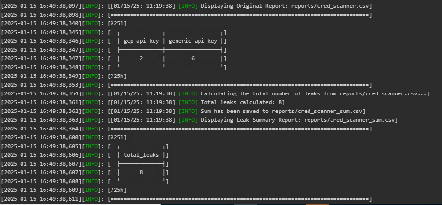

### **Change Log for Docker Image: `registry.buildpiper.in/okts/gitleaks-scan:0.3-mi`**
---
**Version:** `0.3-mi`   
**Release Date:** *null*  
**Maintainer:** *[Email](mukul.joshi@opstree.com), [GitHub](https://github.com/mukulmj)*
### Added
- Initial script to scan Git repositories for credentials using Gitleaks.
- Logging integration with logInfoMessage and logErrorMessage for better visibility.
- Automatic creation of reports directory if it doesn't exist.
- Execution of Gitleaks with customizable report format and output path.
- Aggregation of scan results by RuleID and exporting to cred_scanner.csv.
- Handling of empty scan results by adding no-leaks to the report.
- Base64 encoding of the scan report for data transmission.
- Metadata integration for application, environment, service, organization, and source key.
- Generation and sending of MI data to the specified MI server.
- Error handling when the codebase directory does not exist.
- Task status management and reporting using saveTaskStatus.
---
### **Change Log for Docker Image: `registry.buildpiper.in/okts/gitleaks-scan:0.7.3`**
---
**Version:** `0.7.3`    
**Release Date:** *15-01-2025*  
**Maintainer:** *[Email](mukul.joshi@opstree.com), [GitHub](https://github.com/mukulmj)*

- **Improved Git Repository Scanning:**
    - Enhanced the credential scanning logic by generating a CSV report (`cred_scanner.csv`) and adding a summary file (`${cred_scanner}_sum.csv`) that includes the total count of leaks.
    - Ensured that the `cred_scanner.csv` file always contains either the leak data or a "no-leaks" message.
        
- **Integration with MI Reporting:**
    - Integrated MI data generation and sending functionality to communicate the results with the MI server, improving traceability and reporting.
    
- **Docker Image Updates:**
    - Updated base image and dependencies for improved performance and compatibility.

- **Bug Fixes:**
    - Fixed issues with report formatting for compatibility with downstream tools.

### **Change Log for Docker Image: `registry.buildpiper.in/okts/gitleaks-scan:0.7.4`**
---
**Version:** `0.7.4`    
**Release Date:** *15-01-2025*  
**Maintainer:** *[Email](mukul.joshi@opstree.com), [GitHub](https://github.com/mukulmj)*

### **New Features:**
- **Added tty-table for formatted report display**:  
  Now displays the Gitleaks scan results in a table format using `tty-table`. This allows for a more readable and visually appealing output.  
  *Note: Requires Node.js and npm. To install `tty-table`, run: `npm install -g tty-table`.*
  ```Dockerfile
  RUN apk add --no-cache --upgrade \
    bash jq gettext libintl curl nodejs npm && \
    npm install -g tty-table && \
    rm -rf /var/cache/apk/*
    ```

  

### **Improvements:**
- **Reduced Docker image size**:  
  Combined package installations and cleanup steps into a single `RUN` command, optimizing the overall size of the Docker image.
  
- **Simplified environment variable setup**:  
  Set default values for important environment variables like `APPLICATION_NAME`, `ORGANIZATION`, `SOURCE_KEY`, `REPORT_FILE_PATH`, `FORMAT_ARG`, `OUTPUT_ARG` etc. for ease of use and customization at runtime.

- **Better file handling**:  
  Permissions on the `build.sh` script are ensured to be executable during the build process.

---

### **Change Log for Docker Image: `registry.buildpiper.in/okts/gitleaks-scan:0.7.5`**
---
**Version:** `0.7.5`
**Release Date:** *12-02-2025*  
**Maintainer:** *[Email](mukul.joshi@opstree.com), [GitHub](https://github.com/mukulmj)*

- **Enhanced Git Scanning Efficiency:**
    - Now dynamically determines the commit range using `MAX_COMMITS`, reducing redundant scans.
    - Added `getRepoCloneDepth` to control repository clone depth dynamically.

---

### **Change Log for Docker Image: `registry.buildpiper.in/okts/gitleaks-scan:0.7.8-alpha`**
---
**Version:** `0.7.8-alpha`
**Release Date:** *31-03-2025*  
**Maintainer:** *[Email](mukul.joshi@opstree.com), [GitHub](https://github.com/mukulmj)*

- **Enhanced Git Scanning Efficiency:**
    - Now dynamically determines the commit range using `MAX_COMMITS`, reducing redundant scans.
    - Added `getRepoCloneDepth` to control repository clone depth dynamically.
    - Updated to handle service and environment names for V3 step.

---

**"For any issues or feature requests, please add them to our repository's issue tracker: [BP-GIT-LEAKS-STEP](https://github.com/OT-BUILDPIPER-MARKETPLACE/BP-GIT-LEAKS-STEP)."**
